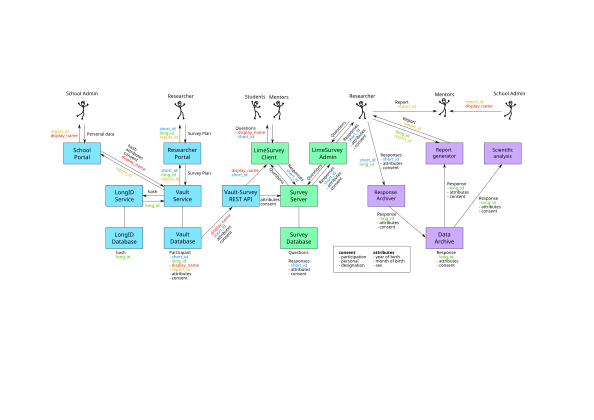
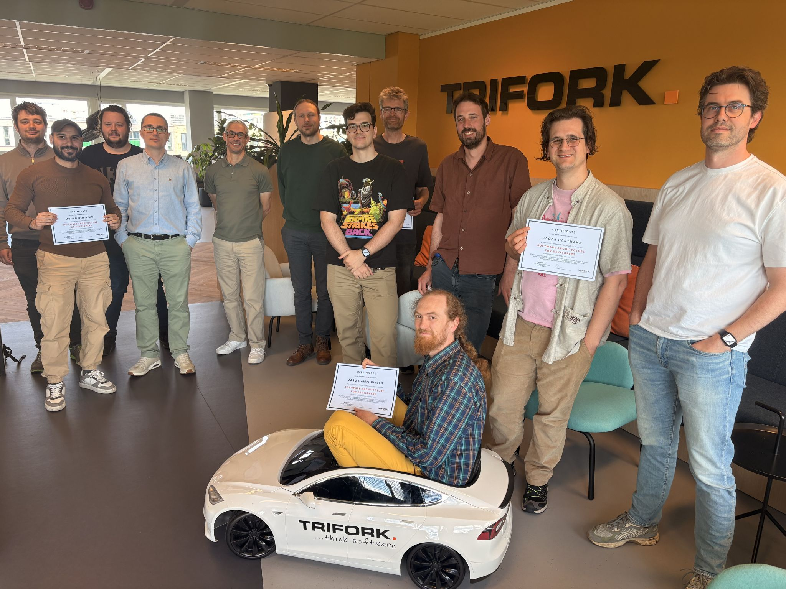
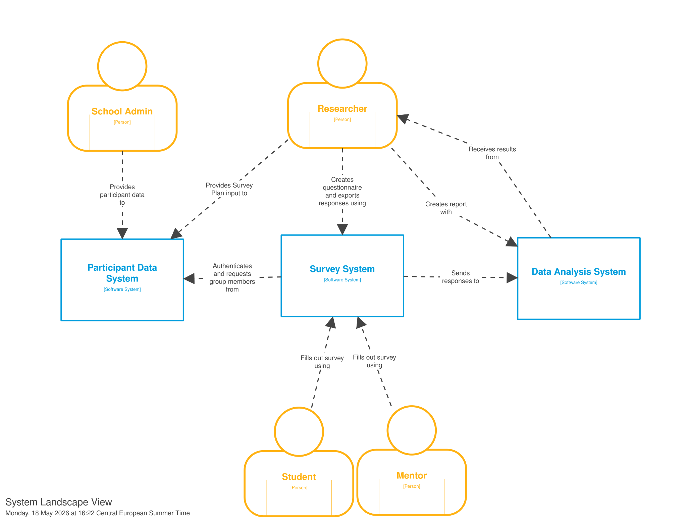
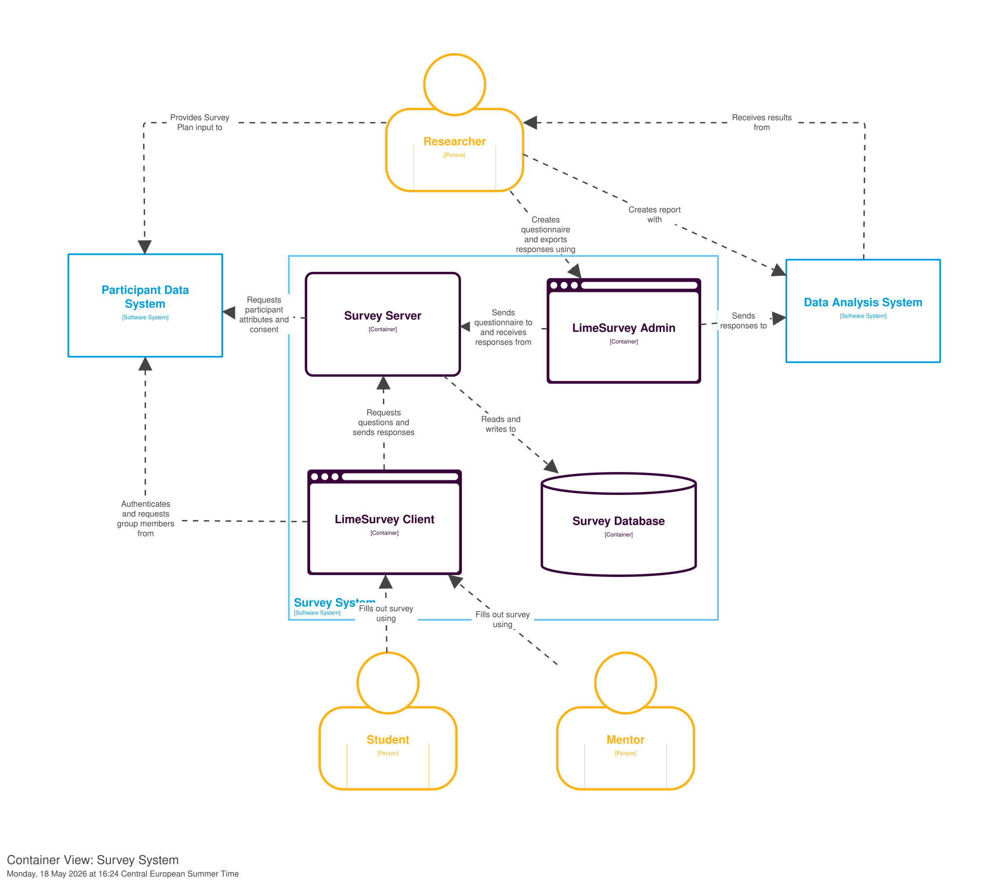

> *"Intelligent people still make very stupid diagrams all the time"*
>
> **- Robin Richardson**

As Research Software Engineers we cannot live without diagrams. We draw these well known box-and-arrow diagrams all the time, to structure our thoughts about the research software software and scientific workflows we design and to communicate these designs to fellow engineers, project partners, funders or other stakeholders. Even more high-level, we use similar box-and-arrow diagrams to represent whole scientific projects in grant proposals. Most of the diagram drawing we do has been self-taught, mimicking others that draw similar diagrams or from examples that we found online. We often say that these diagrams are supposed to clarify the design or even "speak for themselves", but more than often we have to accompany the diagram with walls of text, bullet points, or worse, a set of meetings to explain it.

Clearly something is not going according to plan. That is why three of our Research Software Engineers enrolled for a 2-day workshop called "Software Architecture for Developers" by Simon Brown, the inventor of the C4 model. More about the workshop and the model later, for now, take a look at the following diagram...

Fig 2. The old architecture sketch for the QANS infrastructure

Fig 1. Jaro in a toy car.

vs.

Fig 3.

Fig 4. 

## References

- Webpage (including slides) of the 2-day workshop followed by the authors: https://simonbrown.je/workshops/

# Notes

## Potential Titles

## Audience
Research software engineers, researchers working with software

## Content brainstorm

* What is C4? What are its main features?
- Agnostic to diagram style (i.e. not just another UML)
* C4 Diagrams for eScience Projects
- Fig 2. QANS

- How did we make the figures?
* Is there any difference when applying to research software (vs industry)?
* Benefits of communication with researchers vs e.g. UML
* Brief description of our experience at the training course itself
- Clarify instead of simplify (single arrow without label can have different meanings)

Discuss the different views and how to use them to communicate to various stakeholders
- Landscape (only if you have multiple software systems interacting)
- Context (a software system and its context)
- Container (holds the containers that make up a software system)
- Component (holds the components that make up a container)
- Code (describes the code that implements a component)

Some use cases we have in mind and the different layers of abstraction

- Communication to others
  - communicating with funders in applications
  - communicating with project partners
  - Onboarding new developers/team members
- Structuring your own design/mind
  - Forced labeling of components with tech info helps you to substantialize vague conceptual design ideas
  - Forced labeling of connections (with a verb) helps you to 
  - Explicit different user types and their interaction with system

Show old vs new diagram for QANS

