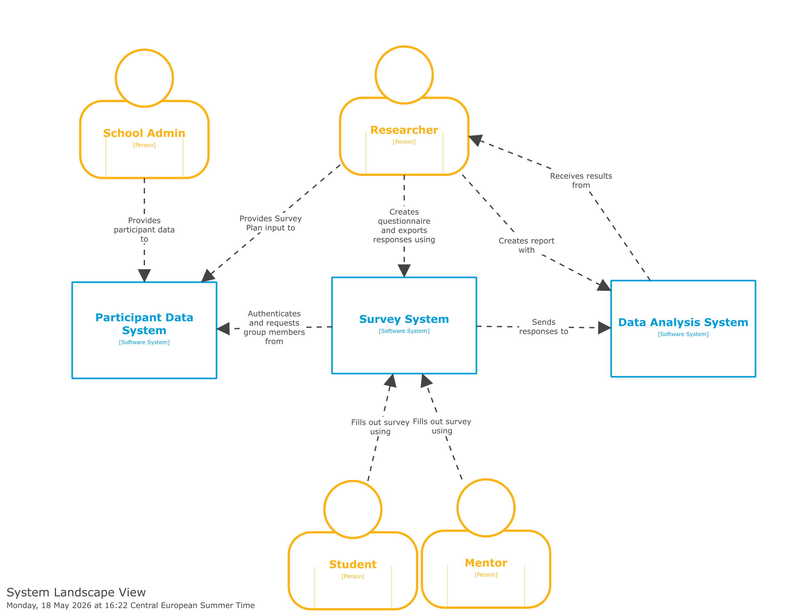

Write the introduction here.

<!--
Image with caption pattern:

<figure>
  
  <figcaption>Short visible caption. Add credit/source links here when needed.</figcaption>
</figure>

Store images next to this index.md file. Use alt text for accessibility; use figcaption for the visible caption.
-->

* Fig 1. Jaro in a toy car.
* What is C4? What are its main features?
- Agnostic to diagram style (i.e. not just another UML)
* C4 Diagrams for eScience Projects
- Fig 2. QANS

- How did we make the figures?
* Is there any difference when applying to research software (vs industry)?
* Benefits of communication with researchers vs e.g. UML
* Brief description of our experience at the training course itself
